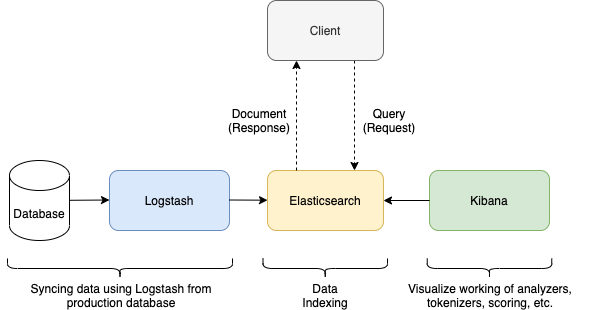

# Personalized Search

This repo mostly contains code related to my Pycon Sweden 2020 talk on "Building Production Ready Search Engine using Python and Elasticsearch"

## Features

- Syncing database with the Elasticsearch. Two ways:
    - Using JDBC driver with Logstash to sync my PostgresDB with my Elasticsearch server.

    - Bulk indexing based on pre-defined mappings in the Elasticsearch and structuring nested data.

- Analyzing Elasticsearch data using Kibana to understand how our search will be returning results to the client on a search query. 

This repo will be covering some use-cases covered during the talk.

## Workflow Architecture

     

## Prerequisites

- Elasticsearch 7.9
- Python 3.8
- Kibana 7.9
- Logstash 7.9

## Usage

To run all the services together on local, make sure all the prerequisites mentioned above are downloaded.

Elasticsearch, Kibana and Logstash can be launched via downloading the zip from their official website and run `bin/<binary-name>` where `<binary-name>` can be `kibana` or `elasticsearch`.

Logstash config file can be referred from this repository. Once donwload of Logstash zip is complete, service can be started using `bin/logstash -f logstash.conf` command.

## Author

👤 Harshit Prasad

Twitter: [@HarshitPrasad8](https://twitter.com/HarshitPrasad8)
Github: [@harshit98](https://github.com/harshit98)
Website: [harshitprasad.com](http://harshitprasad.com)

## 🤝 Contributing

Contributions, issues and feature requests are welcome!

## Show your support

Give a ⭐️ if you think this project is awesome!

## 📝 License

Copyright © 2020 [Harshit Prasad](https://github.com/harshit98).
This project is [Apache License](https://github.com/harshit98/personalized-search/blob/master/LICENSE) licensed.
